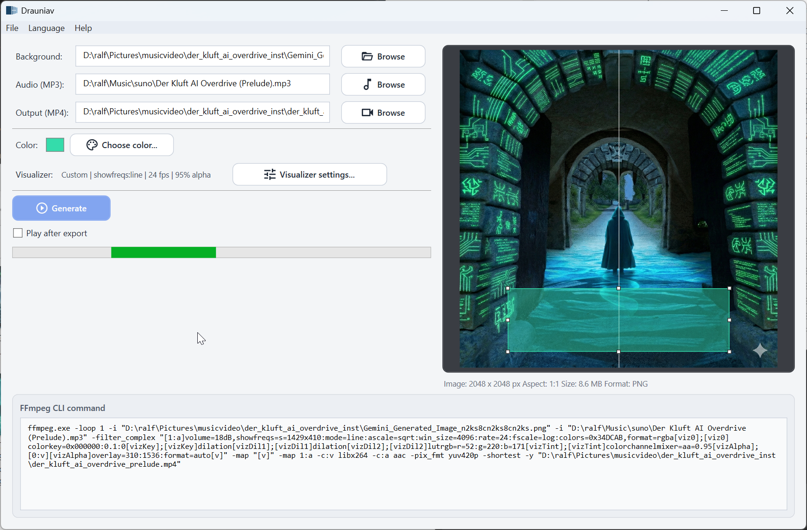

# Drauniav

A lightweight Windows GUI for generating videos from images and audio using FFmpeg visualizations.

## About

**Drauniav** is a lightweight **Windows** GUI wrapper around FFmpeg that generates videos from an image and an audio file using audio visualizations such as spectrum or waveform displays.

The tool was created out of a personal need. I wanted to produce simple videos from a static cover image and a music track. Several video editing programs offer “audio visualizer” effects, but many of them turned out to be more decorative than technically correct — the visuals often didn’t match the actual audio content.

Using FFmpeg directly solved that problem. Its filters produce accurate and flexible visualizations, but working with command-line parameters — especially when experimenting — can be inconvenient. So this small utility was written to simplify the workflow: select an image, select an audio file, adjust options, and generate the video.

Drauniav is intentionally minimal. It doesn’t try to replace video editors or FFmpeg itself — it simply provides a lightweight interface for a very specific task.

The application was created over a short period of time with the help of AI tooling. I’m not a Windows GUI developer by trade, and AI made it possible to quickly build a small tool around my own workflow. Internally, Drauniav only constructs an FFmpeg command based on the selected options, displays that command transparently in the interface, and executes it when you press **Generate**.

The program runs entirely locally, performs no network communication, and does not modify the Windows system. At worst, you might not like the generated video — but the tool itself does not interfere with your system.

If you find it useful, feel free to use it. Feedback and improvements are always welcome.

## Portable Usage

Drauniav is distributed as a portable Windows application.

No installation is required. Simply extract the archive into any directory and run the executable from there. The program does not write registry entries or install background services.

If you want to remove it, just delete the folder.


## Quick Start

1. Download the portable package.
2. Extract it into a folder of your choice.
3. Run `Drauniav.exe`.
4. Select an image and an audio file.
5. Adjust the visualization and settings if desired.
6. Click **Generate**.

That’s it.


## Windows Security Notice

Since Drauniav is currently distributed without a digital code-signing certificate, Windows may display a security warning when you start the application for the first time.

You might see a message similar to:

“Windows protected your PC”

This is normal for new or unsigned applications that do not yet have an established reputation with Microsoft SmartScreen.

To run the application:

1. Click “More info”
2. Click “Run anyway”

Drauniav is fully open source, and the complete code is available in this repository. The application performs no network communication and runs entirely locally.


## Security and Transparency

Drauniav does not send any data over the network, does not perform telemetry, and does not modify the Windows system outside of its own working directory.

The program simply constructs an FFmpeg command based on user-selected options and executes it locally.

You can review the full source code in this repository at any time or build the application yourself.

## Requirements

Drauniav relies on **FFmpeg** for video generation.

FFmpeg must be available on your system (either in PATH or placed next to the executable).

The easiest way to install FFmpeg on Windows is via Winget:

```bash
winget install FFmpeg
```

After installation, Drauniav should detect FFmpeg automatically.

## Screenshots

Example interface:




## Integrity Verification (Optional)

You can verify the integrity of the downloaded archive using a SHA-256 checksum provided in the release notes.

On Windows PowerShell:

```powershell
Get-FileHash .\Drauniav.zip -Algorithm SHA256
```
